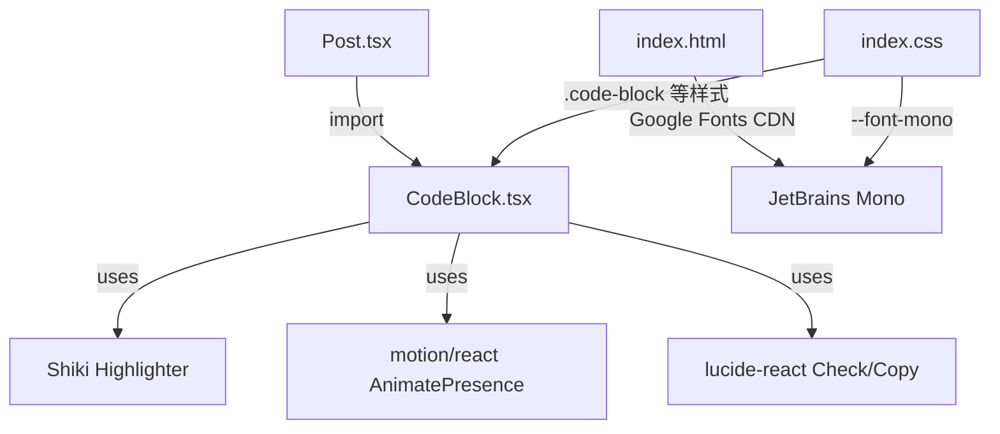

## 用户需求

根据"修改意见2.md"文件，对博客文章页的代码块（CodeBlock）进行视觉升级，采用"磨砂玻璃（Glassmorphism）+ 窗口化容器"设计风格。

## 产品概述

将当前朴素的 Crayon Syntax Highlighter 风格代码块，升级为现代化的 Mac/IDE 仿窗口设计，配合项目已有的液态玻璃设计系统，形成统一的视觉语言。

## 核心功能

- **仿 Mac/IDE 窗口标题栏**：添加红/黄/绿三个功能圆点，语言标签显示在标题栏右侧
- **磨砂玻璃质感**：使用 backdrop-blur + 半透明背景，与项目已有的 `.nav-glass-active`、`.btn-glass-pill` 等液态玻璃系统保持一致
- **复制按钮动画增强**：使用 motion（framer-motion）的 AnimatePresence 实现复制/已复制的缩放动画切换
- **流动渐变背景装饰**：为代码块添加流动渐变色块背景层，增强视觉深度
- **代码字体升级**：将 IBM Plex Mono 替换为 JetBrains Mono
- **组件拆分**：将 CodeBlock 从 Post.tsx 中提取为独立组件文件，提升代码组织性

## 技术栈

- React 19 + TypeScript（项目已有）
- Tailwind CSS 4（项目已有）
- motion（framer-motion v12，从 `motion/react` 导入，项目已安装）
- Shiki 4（双主题 one-light / monokai，项目已安装）
- lucide-react（Check, Copy 图标，项目已安装）
- JetBrains Mono（通过 Google Fonts CDN 加载）

## 实现方案

### 整体策略

在不破坏现有 Shiki 高亮引擎、行号系统、react-markdown 接入方式的前提下，仅做**视觉层的升级改造**：

1. 将 CodeBlock 提取为独立组件 `src/components/CodeBlock.tsx`，同时将 Shiki 单例高亮器 `getShikiHighlighter` 一起迁移
2. 在组件 JSX 中增加 Mac 窗口圆点标题栏、使用 motion 的 AnimatePresence 动画复制按钮、流动渐变装饰层
3. CSS 层面重写 `.code-block`、`.code-header`、`.code-copy` 等类，对齐项目已有的液态玻璃设计系统（与 `.nav-glass-active` 同一套参数）
4. 在 `index.html` 中将 Google Fonts 的 IBM Plex Mono 替换为 JetBrains Mono，同步更新 `@theme` 中的 `--font-mono`

### 关键技术决策

- **不使用修改意见中的 FluidGlassDecoration 作为独立组件**：该组件的 600px 大面积模糊渐变色块性能开销大，且在博客文章中会与文章内容背景冲突。改为在代码块 CSS 中使用静态渐变 + backdrop-blur 实现类似视觉效果，更轻量且与液态玻璃系统一致。
- **不使用 @shikijs/transformers**：虽然已安装，但修改意见中仅提到"可以"使用，且当前 Shiki 基础高亮已满足需求，后续可按需添加。
- **CSS 而非 Tailwind 类驱动代码块样式**：项目已有完整的 CSS 类体系（`.code-block` 等），保持一致，同时液态玻璃系统也在 CSS 中定义。但标题栏内部元素（圆点、按钮）使用 Tailwind 类，降低 CSS 复杂度。

### 架构设计



### 实现细节

- CodeBlock 组件 Props 保持 `{ className, children }` 不变，Post.tsx 中的 `pre` 拦截器无需改动
- 复制按钮使用 `AnimatePresence mode="wait"` + `motion.div` 实现图标切换缩放动画
- 暗色模式下代码块玻璃效果使用与 `.dark .nav-glass-active` 相同的参数体系

## 文件变更清单

```
src/
├── components/
│   └── CodeBlock.tsx          # [NEW] 从 Post.tsx 提取的独立代码块组件
├── pages/
│   └── Post.tsx               # [MODIFY] 移除 CodeBlock 定义和 getShikiHighlighter，改为 import
├── index.css                  # [MODIFY] 重写代码块 CSS 样式（第100~334行），升级为玻璃风格
index.html                     # [MODIFY] Google Fonts 链接从 IBM Plex Mono 改为 JetBrains Mono
```

## 性能考量

- CodeBlock 使用 React.memo 保持原有的浅比较优化，避免不必要的重渲染
- Shiki 单例高亮器保持懒初始化全局共享，无额外开销
- 流动渐变改为 CSS 静态渐变，避免了修改意见中 motion 流动动画对每个代码块的性能消耗
- JetBrains Mono 通过 CDN 加载且设置 `font-display: swap`，不影响首屏渲染

## 设计风格

代码块采用"Glassmorphism + Mac 窗口"风格，与项目已有的液态玻璃设计系统统一。

### 亮色模式

- 代码块外壳：`rgba(255, 255, 255, 0.82)` 背景 + `backdrop-filter: blur(20px) saturate(180%)`，与 `.nav-glass-active` 同参数
- 标题栏：半透明白底，左侧红/黄/绿三圆点（80%不透明度），右侧语言标签 + 复制按钮
- 代码区：`rgba(245, 242, 238, 0.5)` 浅色半透明底，配合 Shiki one-light 主题
- 行号区：保留斑马纹但使用更柔和的半透明色

### 暗色模式

- 代码块外壳：`rgba(255, 255, 255, 0.09)` 背景 + 同款 backdrop-filter，与 `.dark .nav-glass-active` 一致
- 标题栏：深色半透明底，圆点保持 80% 不透明度
- 代码区：深色半透明底，配合 Shiki monokai 主题

### 交互效果

- 复制按钮：hover 时背景微亮 + 文字变白，点击时 AnimatePresence 缩放动画切换 Check/Copy 图标
- 代码块整体：圆角 12px，配合三层阴影（外发光 + 投影 + 内高光），与 `.nav-glass-active` 一致
- `::before` 伪元素 135 度光泽渐变，模拟玻璃内部光线折射

### 页面块设计

代码块在文章中作为独立卡片存在，上下 margin 24px，视觉上与正文清晰分隔。

## Agent Extensions

### SubAgent

- **code-explorer**
- Purpose: 在实现过程中验证代码块样式与项目已有液态玻璃系统的一致性，确认所有相关 CSS 类的引用关系
- Expected outcome: 确保代码块玻璃效果与侧边栏、按钮等现有组件视觉统一